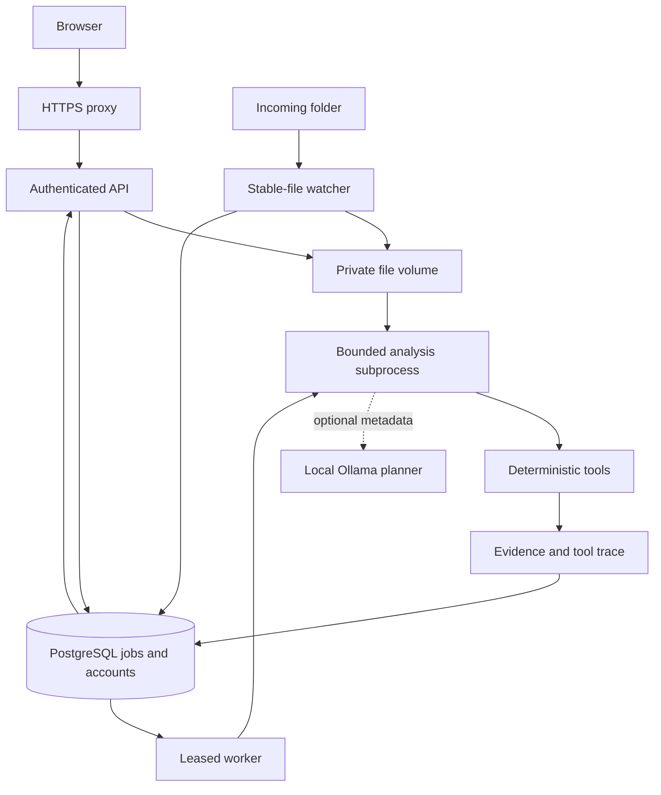
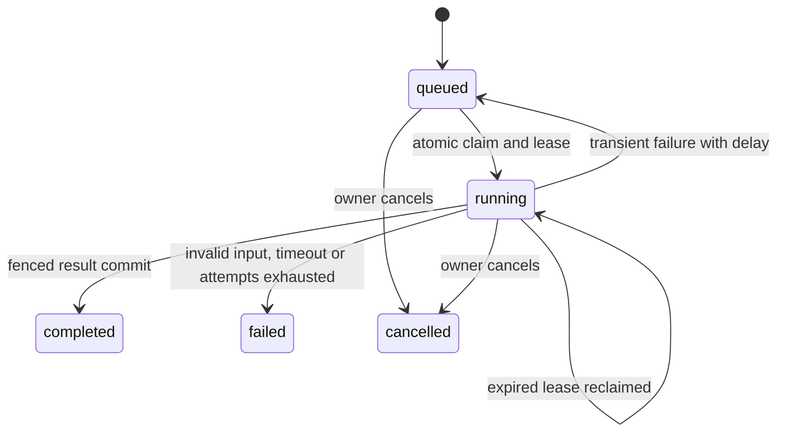

# Architecture

## Deployment model

One Linux host runs an HTTPS reverse proxy, an API process, a PostgreSQL database, one or more workers and an optional watcher. API/workers/watcher share a private durable volume. The browser is a same-origin static dashboard served by FastAPI. No third-party assets, analytics or hosted model dependency are required.

## Ingestion

The API streams request bytes into a private staging file while computing SHA-256. It caps the request before JSON parsing and again during streaming. Filenames are display metadata; generated UUID names control storage paths. The staging file is flushed and fsynced, atomically renamed, and directory metadata is fsynced on supporting systems.

A PostgreSQL user row lock serializes account storage and job quota decisions. The database commit registers the dataset. A failed commit acknowledgement leaves the file intact because commit outcome can be uncertain; cleanup removes unreferenced files only after 24 hours. This is a recoverable filesystem/database boundary, not a distributed transaction.

The watcher uses a size/mtime stability interval plus a copy verification check, SHA-256, generated storage names and duplicate lookup. Polling also discovers files present before startup. Producers must close then rename files into the watched folder; stability observation cannot guarantee consistency against a hostile concurrent writer.

## Job state and recovery

Claims use `FOR UPDATE SKIP LOCKED` on PostgreSQL and an additional conditional UPDATE. Every attempt gets a new random lease token. The parent renews the lease while a child runs. Results commit only if status is still running and the token still matches. A cancelled or superseded attempt cannot overwrite current results. A process can execute more than once after a failure: semantics are **at-least-once execution with fenced result commits**, not exactly-once execution.

The worker writes no user-directed external side effects. Deterministic tool execution makes duplicate computation safe. Transient failures retry up to three attempts by default, with 2/4-second delays before subsequent attempts. Parser errors and wall-clock timeouts are permanent. A user-requested retry creates a new job, preserving the original record.

## Analysis stages

1. Verify source SHA-256/size, decode UTF-8 and iterate format-specific flat records. Reject malformed columns, duplicate JSON/log fields, nested JSON, oversized records and over-limit datasets. Reject a source whose size or modification time changes during analysis.
2. Maintain exact per-column aggregates with Welford's method and a reproducible reservoir sample using seed 42. Sample text is capped at 256 characters; numeric values are preserved.
3. Build a plan from observed types and the objective. Optional Ollama receives a JSON schema and metadata only. Validate its output against an allowlist, deduplicate calls and append mandatory safety coverage.
4. Run schema, quality, statistics, correlations and anomaly checks as selected. Correlation work is capped at 32 numeric columns. Findings are produced only by deterministic Python tools.
5. Collect results, error status, execution durations, evidence and limitations. Exports preserve dataset checksum and distinguish exact counts from sample-derived observations.

No `eval`, arbitrary code execution, model-driven network tools or shell access is exposed. The model can select approved tools but cannot supply statistics, alter thresholds, disable mandatory checks or invent final findings.

## Extensibility

To add a tool, define a function with `(profile, thresholds) -> (output, findings)`, register it in `TOOLS`, extend the Literal schema, specify its evidence/sampling contract, and add meaningful correctness and failure-isolation tests. Keep resource limits and payload caps aligned. Database changes require a new Alembic revision; do not edit a migration after it has been deployed.

For multi-host scaling, replace direct filesystem paths with an authenticated storage abstraction and immutable object keys; implement retention, backup consistency and failover before deploying replicas across hosts. That extension is not present in 1.1.0.

## Primary design references

- FastAPI container deployment: https://fastapi.tiangolo.com/deployment/docker/
- PostgreSQL SELECT / row locking: https://www.postgresql.org/docs/current/sql-select.html
- Ollama structured outputs: https://docs.ollama.com/capabilities/structured-outputs
- Caddy request limits: https://caddyserver.com/docs/caddyfile/directives/request_body
- Caddy server timeouts: https://caddyserver.com/docs/caddyfile/options
